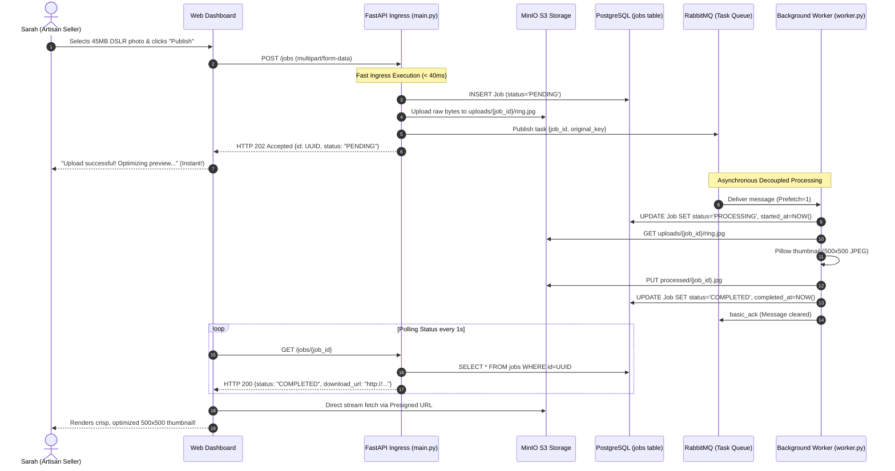

# Real-World Human Scenario: The Artisan Gallery & High-Res Ingestion Pipeline

> **Document:** `HUMAN_SCENARIO.md`  
> **Context:** An end-to-end, human-centered walkthrough demonstrating how this Distributed Media Processing engine solves real human and business problems from start to finish.

---

## 1. Dramatis Personae (The Human Context)

| Actor | Role | Human Goal | Pain Point on Legacy Systems |
| :--- | :--- | :--- | :--- |
| **Sarah Rahman** | Artisan Jewelry Designer & Merchant (*ArtisanHub*) | Wants to upload 4K macro photos (30–60 MB each) of her handmade silver filigree jewelry to her online store. | In synchronous systems, uploads freeze her browser for 45+ seconds, frequently timing out (`504 Gateway Timeout`) and losing her work. |
| **Rahim Ahmed** | Platform DevOps & Backend Lead | Wants the marketplace platform to stay fast, responsive, and available for thousands of concurrent buyers and sellers. | Heavy image resizing operations spike the API server's CPU to 100%, causing cascading failures and denial-of-service for everyone. |
| **The Distributed Engine** | This Codebase (FastAPI + MinIO + RabbitMQ + Worker) | Offloads heavy CPU computations away from the API, providing instant user feedback and resilient asynchronous processing. | None — designed specifically to eliminate bottlenecks, isolate faults, and scale horizontally. |

---

## 2. The Timeline: From Camera Shutter to Live Marketplace



---

## 3. Step-by-Step Narrative Walkthrough

### Act I: The Upload Crisis (10:00:00 AM)
Sarah just finished hand-crafting an intricate silver filigree wedding ring. She takes a series of macro photographs using her professional DSLR camera. Each RAW/high-res JPEG image is **45 megabytes** in size.

* **Without this system (The Legacy Nightmare):**  
  Sarah clicks "Upload". The old monolithic server starts decoding a 6000x4000 pixel image right inside the HTTP request thread. The thread pegs the CPU at 100%. After 30 seconds, Sarah's browser shows:  
  `504 Gateway Timeout: The server did not respond in time.`  
  Sarah assumes the upload failed, gets frustrated, and tries repeatedly, multiplying the server load and threatening to crash the entire marketplace.

* **With this Distributed System:**  
  Sarah clicks "Upload". Her web browser initiates an HTTP `POST /jobs` multipart request with the 45MB photo.

---

### Act II: Sub-50 Millisecond Ingress (10:00:01 AM)
1. The **FastAPI API Server** receives the file stream.
2. It assigns a globally unique identifier: `job_id = 9b1deb4d-3b7d-4bad-9bdd-2b0d7b3dcb6d`.
3. It creates a row in **PostgreSQL**:
   - `id`: `9b1deb4d-3b7d-4bad-9bdd-2b0d7b3dcb6d`
   - `original_filename`: `"handmade_silver_filigree_ring.jpg"`
   - `status`: `"PENDING"`
   - `created_at`: `2026-10-08 10:00:01.120+00`
4. It streams the raw image bytes into **MinIO Object Storage** under the key:  
   `uploads/9b1deb4d-3b7d-4bad-9bdd-2b0d7b3dcb6d/handmade_silver_filigree_ring.jpg`.
5. It publishes an AMQP message to the **RabbitMQ** queue `media_processing_jobs`:
   ```json
   {
     "job_id": "9b1deb4d-3b7d-4bad-9bdd-2b0d7b3dcb6d",
     "original_key": "uploads/9b1deb4d-3b7d-4bad-9bdd-2b0d7b3dcb6d/handmade_silver_filigree_ring.jpg"
   }
   ```
6. The API returns an **HTTP 202 Accepted** response back to Sarah's browser in just **34 milliseconds**:
   ```json
   {
     "id": "9b1deb4d-3b7d-4bad-9bdd-2b0d7b3dcb6d",
     "status": "PENDING",
     "original_filename": "handmade_silver_filigree_ring.jpg",
     "original_key": "uploads/9b1deb4d-3b7d-4bad-9bdd-2b0d7b3dcb6d/handmade_silver_filigree_ring.jpg"
   }
   ```

**The Human Experience:** Sarah's screen instantly updates:  
> *“Photo uploaded successfully! Creating high-speed preview...”*  
Sarah feels confident that her asset is safe.

---

### Act III: The Distributed Worker at Work (10:00:02 AM)
Meanwhile, in a separate compute container, the **Background Worker** (`worker.py`) is listening to RabbitMQ:

1. **Fair Dispatch:** Because RabbitMQ is configured with `prefetch_count=1`, this worker only takes one image at a time, ensuring that other workers in the cluster can concurrently handle uploads from other artisans.
2. **State Transition to PROCESSING:** The worker receives the message and immediately marks the job in PostgreSQL:
   - `status = "PROCESSING"`
   - `started_at = 2026-10-08 10:00:02.040+00`
3. **Data Retrieval:** The worker streams the raw 45MB image buffer from MinIO across the internal Docker network.
4. **Thumbnail Generation:**
   - Worker loads the buffer with Pillow (`PIL.Image`).
   - Executes `image.thumbnail((500, 500))` preserving high aspect-ratio crispness.
   - Converts color space to standard RGB and encodes as a lightweight 85 KB JPEG thumbnail.
5. **Asset Persistence:** The worker uploads the thumbnail back to MinIO:
   - Key: `processed/9b1deb4d-3b7d-4bad-9bdd-2b0d7b3dcb6d.jpg`
6. **Completion in Database:** The worker records completion in PostgreSQL:
   - `status = "COMPLETED"`
   - `output_key = "processed/9b1deb4d-3b7d-4bad-9bdd-2b0d7b3dcb6d.jpg"`
   - `completed_at = 2026-10-08 10:00:03.110+00`
7. **Message Acknowledgment:** The worker calls `ch.basic_ack()`. RabbitMQ removes the task from the queue.

---

### Act IV: Secure Delivery & Joyful Outcome (10:00:03 AM)
Sarah's web dashboard was polling `GET /jobs/9b1deb4d-3b7d-4bad-9bdd-2b0d7b3dcb6d` every second.

1. On the 2nd poll, the API server retrieves the `COMPLETED` row from PostgreSQL.
2. The API uses the public MinIO client to generate a temporary, cryptographically signed S3 download URL:
   ```json
   {
     "id": "9b1deb4d-3b7d-4bad-9bdd-2b0d7b3dcb6d",
     "status": "COMPLETED",
     "original_filename": "handmade_silver_filigree_ring.jpg",
     "output_key": "processed/9b1deb4d-3b7d-4bad-9bdd-2b0d7b3dcb6d.jpg",
     "download_url": "http://localhost:9000/media-bucket/processed/9b1deb4d-3b7d-4bad-9bdd-2b0d7b3dcb6d.jpg?AWSAccessKeyId=minioadmin&Signature=...&Expires=1791444003",
     "error": null
   }
   ```
3. Sarah's browser fetches the thumbnail directly from MinIO using the presigned URL.
4. The dashboard renders her brilliant silver ring in stunning clarity.

**Total human elapsed time:** Under 3 seconds. Zero server slowdown. Zero lost data.

---

### Act V: The Failure Scenario (Fault Tolerance in Action)
Suppose Sarah's apprentice accidentally uploads an incomplete or corrupted file named `damaged_render.png`.

1. The API server ingests it and returns `202 Accepted` (the API does not crash on corrupt files).
2. The worker downloads the file and attempts `Image.open(raw_buffer)`.
3. Pillow raises `UnidentifiedImageError: cannot identify image file`.
4. The worker's exception boundary catches the error:
   - Sets `status = "FAILED"`
   - Records `error = "cannot identify image file <_io.BytesIO object...>"`
   - Sets `completed_at = NOW()`
   - Commits to PostgreSQL so the error is permanently auditable.
   - Acknowledges the message to RabbitMQ (`basic_ack`) so a poison-pill message does not block subsequent jobs.
5. On the next poll, Sarah's dashboard displays:  
   > *“The file ‘damaged_render.png’ could not be read. Please check your file format and try again.”*
6. The platform remains 100% stable; other workers continue processing valid customer orders uninterrupted.

---

## 4. Key Architectural Takeaways

| Feature | Human Benefit | Technical Mechanism |
| :--- | :--- | :--- |
| **Instant 202 Ingress** | Sarah never stares at frozen screens. | Asynchronous job creation + RabbitMQ task offloading. |
| **Zero CPU Starvation** | Platform never goes down for buyers. | API servers do zero image crunching; workers scale independently. |
| **Stateless Scalability** | Millions of photos can be handled. | MinIO S3 object storage replaces local filesystem constraints. |
| **Direct-to-Client Delivery** | Server bandwidth is conserved. | S3 Presigned URLs stream media straight from storage to browser. |
| **Poison Pill Isolation** | Bad uploads don't kill the cluster. | Robust error catching, DB error tracking, and fair queue acknowledgment. |
