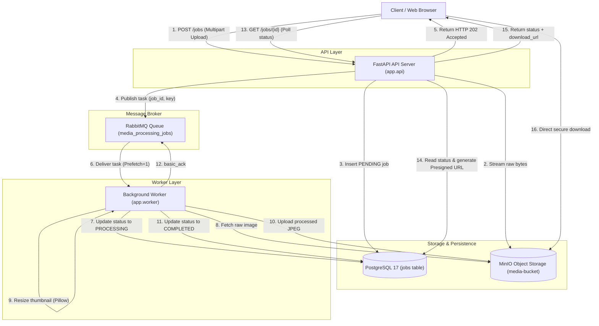

# Distributed Media Processing Engine
## Scalable, Asynchronous Image Processing Pipeline with RabbitMQ & MinIO

> **Author:** Md. Saimon Hasan Emon (Backend & Systems Engineer)  
> **Tech Stack:** Python 3.12+, FastAPI, PostgreSQL 17, MinIO (S3 API), RabbitMQ, Pillow, Docker  
> **Architecture:** Decoupled Event-Driven Microservices  

---

## 1. System Overview

This project is a high-throughput, horizontally scalable media processing system designed to eliminate server starvation during heavy media transformations. It demonstrates how to transition from a naive synchronous API into a decoupled, event-driven architecture using **FastAPI**, **RabbitMQ**, **PostgreSQL**, and **MinIO (S3-compatible object storage)**.

### Core Engineering Guarantees:
1. **Sub-50ms Non-Blocking Ingress:** File uploads are accepted immediately via HTTP `202 Accepted`. Heavy CPU computations are offloaded to background workers.
2. **Stateless Scalability:** No media files are stored on local container filesystems. Raw and processed assets live in MinIO S3 object storage.
3. **Guaranteed Delivery & Zero Task Loss:** RabbitMQ durable queues (`durable=True`) and persistent message delivery (`delivery_mode=2`) ensure tasks survive broker restarts.
4. **Fair Workload Distribution:** Workers enforce `prefetch_count=1`, guaranteeing that tasks are balanced across worker instances regardless of varying image dimensions.
5. **Poison-Pill Fault Isolation:** Malformed or corrupt image files are trapped in resilient exception boundaries, recorded as `FAILED` in PostgreSQL, and acknowledged from the queue to prevent crash loops.
6. **Direct-to-Client Asset Egress:** Processed media files are delivered via temporary, cryptographically signed S3 Presigned URLs, conserving API egress bandwidth.
7. **Graceful OS Signal Interception:** Workers intercept Linux `SIGINT` and `SIGTERM` signals to drain in-flight image tasks before shutting down cleanly.

---

## 2. High-Level System Architecture



---

## 3. Master Documentation Index

All architectural blueprints, system design trade-offs, and verification manuals are available in the [`docs/`](file:///home/saimon/Emon_work/project/Distributed_Media_Processing/docs) directory:

| Document | Description |
| :--- | :--- |
| [**HUMAN_SCENARIO.md**](file:///home/saimon/Emon_work/project/Distributed_Media_Processing/HUMAN_SCENARIO.md) | **End-to-End Human Walkthrough:** Real-world story of artisan seller Sarah Rahman uploading 4K DSLR photos. |
| [**PHASES.md**](file:///home/saimon/Emon_work/project/Distributed_Media_Processing/PHASES.md) | **Implementation Roadmap:** Phase-by-phase engineering milestones. |
| [**00. Master Interview Defense**](file:///home/saimon/Emon_work/project/Distributed_Media_Processing/docs/00_MASTER_KNOWLEDGE_AND_INTERVIEW_DEFENSE_MANUAL.md) | **Interview Defense Manual:** Technical trade-offs, queueing protocols, and architectural Q&A. |
| [**01. Project Vision & Lifecycle**](file:///home/saimon/Emon_work/project/Distributed_Media_Processing/docs/01_PROJECT_VISION_AND_LIFECYCLE.md) | System motivation, job finite state machine (`PENDING` $\rightarrow$ `COMPLETED`). |
| [**02. Architecture & LLD Patterns**](file:///home/saimon/Emon_work/project/Distributed_Media_Processing/docs/02_ARCHITECTURE_AND_LLD_PATTERNS.md) | Layered package structure, GoF/Cloud patterns (Storage Gateway, Competing Consumers). |
| [**03. Core CS Deep Dive**](file:///home/saimon/Emon_work/project/Distributed_Media_Processing/docs/03_CORE_CS_DEEP_DIVE.md) | AMQP 0-9-1 internals, in-memory zero-copy streams, HMAC-SHA256 presigned URL crypto. |
| [**04. Module Specifications**](file:///home/saimon/Emon_work/project/Distributed_Media_Processing/docs/04_MODULE_AND_COMPONENT_SPECIFICATIONS.md) | Component-by-component schema, column, and interface specifications. |
| [**05. Testing & Verification**](file:///home/saimon/Emon_work/project/Distributed_Media_Processing/docs/05_TESTING_BENCHMARKING_AND_VERIFICATION.md) | Integration test execution, happy path validation, and poison-pill recovery checks. |
| [**06. System Flow Diagram**](file:///home/saimon/Emon_work/project/Distributed_Media_Processing/docs/06_END_TO_END_SYSTEM_FLOW_DIAGRAM.md) | Complete end-to-end Mermaid sequence and data transformation matrix. |
| [**07. Implementation Phases**](file:///home/saimon/Emon_work/project/Distributed_Media_Processing/docs/07_IMPLEMENTATION_PHASES.md) | Exhaustive implementation phase details and deliverable breakdowns. |
| [**08. Human Scenario Walkthrough**](file:///home/saimon/Emon_work/project/Distributed_Media_Processing/docs/08_HUMAN_SCENARIO_WALKTHROUGH.md) | Detailed metrics, latencies, and business impact for the user story. |

---

## 4. Directory Structure

```
Distributed_Media_Processing/
├── app/
│   ├── api/                     # Presentation layer
│   │   ├── routes/              # Sub-routers (/health, /jobs)
│   │   ├── main.py              # FastAPI application factory & lifespan
│   │   └── schemas.py           # Pydantic validation schemas
│   ├── core/                    # Core configuration
│   │   └── config.py            # Typed settings & environment variables
│   ├── domain/                  # Domain entities
│   │   └── models.py            # SQLAlchemy Job schema & JobStatus
│   ├── infrastructure/          # External integrations
│   │   ├── database.py          # PostgreSQL sessionmaker & engine
│   │   ├── storage.py           # MinIO / S3 wrapper (stream I/O, presigned URLs)
│   │   └── rabbitmq.py          # AMQP connection factory & task publisher
│   └── worker/                  # Background worker
│       └── consumer.py          # RabbitMQ consumer & Pillow resizing engine
├── docs/                        # Complete technical documentation suite (00 - 08)
├── tests/                       # Integration & unit test suites
│   ├── conftest.py              # Fixtures & mock byte sequences
│   ├── test_health.py           # Health check verification
│   └── test_e2e_pipeline.py     # End-to-end valid & failure pipeline tests
├── .env.example                 # Environment configuration blueprint
├── docker-compose.yml           # Multi-container orchestration (5 services)
├── Dockerfile                   # Container build recipe
├── HUMAN_SCENARIO.md            # Real-world end-to-end human walkthrough
├── PHASES.md                    # Engineering roadmap & phase index
├── requirements.txt             # Pinned project dependencies
└── test_app.py                  # Test runner entrypoint
```

---

## 5. Quickstart & Deployment

### Prerequisites:
- **Docker** and **Docker Compose**
- **Python 3.12+** (optional, for running tests locally outside Docker)

### 1. Configure Environment:
```bash
cp .env.example .env
```

### 2. Launch the System:
```bash
docker compose up --build -d
```
This spins up 5 coordinated services:
- **`api`:** FastAPI web server exposed on `http://localhost:8000`
- **`worker`:** Media processing consumer listening to RabbitMQ
- **`db`:** PostgreSQL 17 database on port `5432`
- **`minio`:** S3-compatible object storage on port `9000` (Console on `http://localhost:9001`)
- **`rabbitmq`:** AMQP message broker on port `5672` (Management UI on `http://localhost:15672`)

---

## 6. API Usage Guide

### 1. Health Check
```bash
curl -X GET http://localhost:8000/health
```
```json
{
  "status": "Healthy"
}
```

### 2. Submit Media for Processing (Non-Blocking)
```bash
curl -X POST http://localhost:8000/jobs \
  -F "file=@/path/to/my_photo.jpg"
```
**Response (`202 Accepted` in $<50\text{ms}$):**
```json
{
  "id": "3fa85f64-5717-4562-b3fc-2c963f66afa6",
  "status": "PENDING",
  "original_filename": "my_photo.jpg",
  "original_key": "uploads/3fa85f64-5717-4562-b3fc-2c963f66afa6/my_photo.jpg"
}
```

### 3. Poll Job Status & Retrieve Presigned Download URL
```bash
curl -X GET http://localhost:8000/jobs/3fa85f64-5717-4562-b3fc-2c963f66afa6
```
**Response (`200 OK` when completed):**
```json
{
  "id": "3fa85f64-5717-4562-b3fc-2c963f66afa6",
  "status": "COMPLETED",
  "original_filename": "my_photo.jpg",
  "original_key": "uploads/3fa85f64-5717-4562-b3fc-2c963f66afa6/my_photo.jpg",
  "created_at": "2026-10-08T10:00:01.000Z",
  "started_at": "2026-10-08T10:00:02.000Z",
  "completed_at": "2026-10-08T10:00:03.000Z",
  "output_key": "processed/3fa85f64-5717-4562-b3fc-2c963f66afa6.jpg",
  "error": null,
  "download_url": "http://localhost:9000/media-bucket/processed/3fa85f64-5717-4562-b3fc-2c963f66afa6.jpg?AWSAccessKeyId=minioadmin&Signature=..."
}
```

---

## 7. Automated Verification & Testing

Execute the end-to-end integration test suite against the running stack:
```bash
python test_app.py
```
This tests:
1. API liveness probe.
2. Valid image processing, status transition to `COMPLETED`, and direct S3 presigned URL download.
3. Poison pill isolation: Uploads corrupt bytes, verifies transition to `FAILED`, and checks error details.
