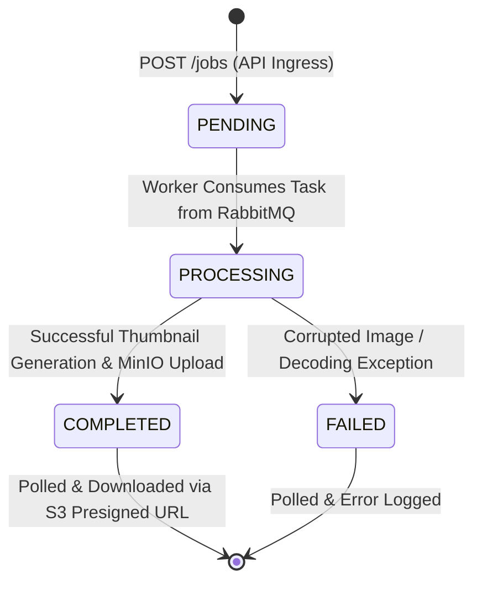

# Project Vision, Architectural Principles & Job Lifecycle

> **Document:** `docs/01_PROJECT_VISION_AND_LIFECYCLE.md`

---

## 1. Problem Statement & Motivation

Modern content platforms (e-commerce storefronts, photo studios, social media, newsrooms) receive massive volumes of media uploads daily. These uploads range from uncompressed 4K smartphone photos to 60MB raw digital camera portraits.

Transforming these raw files into web-optimized thumbnails and responsive resolutions involves heavy, CPU-intensive matrix operations:
- **Image decompression and parsing**
- **Lanczos/Bilinear resampling**
- **Color profile normalization (RGB / sRGB)**
- **Compression and encoding (JPEG/WebP)**

Executing these operations synchronously inside HTTP request threads leads to catastrophic failure modes:
1. **Thread Pool Exhaustion:** Worker processes freeze, unable to accept incoming requests.
2. **Cascading Timeouts:** Upstream proxies (Nginx, Cloudflare, AWS ALB) terminate requests with HTTP `504 Gateway Timeout`.
3. **Loss of High-Value Assets:** Frustrated users abandon uploads or trigger retry storms that compound load.

This engine solves the problem by implementing a **distributed, decoupled, asynchronous event-driven architecture**.

---

## 2. Job Lifecycle State Machine

A media task transitions through four well-defined monotonic states:

### State Specifications:
1. **`PENDING`:**
   - Trigger: Created when the API receives an upload and writes the initial record to PostgreSQL.
   - Operations: Raw media file is saved in MinIO (`uploads/{job_id}/...`), and an AMQP task is enqueued in RabbitMQ.
   - Response: Client receives `202 Accepted` immediately.

2. **`PROCESSING`:**
   - Trigger: Background worker receives the message from RabbitMQ.
   - Operations: Worker stamps `started_at = NOW()`, fetches the original file from MinIO, and begins Pillow thumbnail operations.

3. **`COMPLETED`:**
   - Trigger: Image successfully resized and uploaded to `processed/{job_id}.jpg`.
   - Operations: Worker updates `output_key`, stamps `completed_at = NOW()`, and acknowledges the message (`basic_ack`).
   - Outcome: When the client queries `GET /jobs/{job_id}`, the API issues an expiring presigned S3 download link.

4. **`FAILED`:**
   - Trigger: An unrecoverable error occurs (corrupted file format, missing buffer, invalid payload).
   - Operations: Worker catches the exception, updates `status = FAILED`, writes the stack trace into `error`, records `completed_at`, and sends `basic_ack` to clear the queue.

---

## 3. Core Architectural Principles

- **Zero Blocking at the Edge:** All CPU-bound tasks must be offloaded from API servers.
- **Stateless Application Tier:** Neither API servers nor workers retain state on local disks; all state lives in MinIO (assets) or PostgreSQL (metadata).
- **At-Least-Once Delivery & Safe Acknowledgment:** Tasks remain in RabbitMQ until the worker explicitly confirms completion or safe failure logging.
- **Direct-to-Storage Client Egress:** Heavy bandwidth-consuming file downloads must never burden the application layer; S3 presigned URLs offload delivery directly to object storage.
