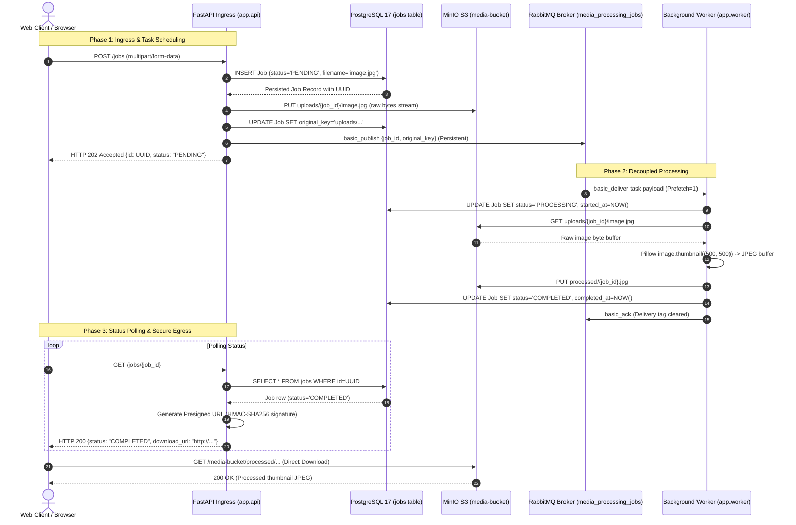

# End-to-End System Flow & Architecture Diagrams

> **Document:** `docs/06_END_TO_END_SYSTEM_FLOW_DIAGRAM.md`

---

## 1. Complete End-to-End Execution Flow

---

## 2. Component Responsibility Matrix

| Component | Responsibility | Tech Stack |
| :--- | :--- | :--- |
| **API Ingress** | Multipart file streaming, validation, job orchestration, polling. | FastAPI, Uvicorn, Pydantic |
| **Relational Store** | State tracking, audit history, timestamps, error records. | PostgreSQL 17, SQLAlchemy |
| **Object Store** | Raw image storage, processed thumbnail storage, direct URL streaming. | MinIO, Boto3 S3 API |
| **Message Broker** | Asynchronous queuing, durable message buffering, fair dispatch. | RabbitMQ 3, Pika AMQP |
| **Worker Engine** | Image resampling, format conversion, thumbnail generation, graceful signal draining. | Pillow (PIL), Python 3.12 |
